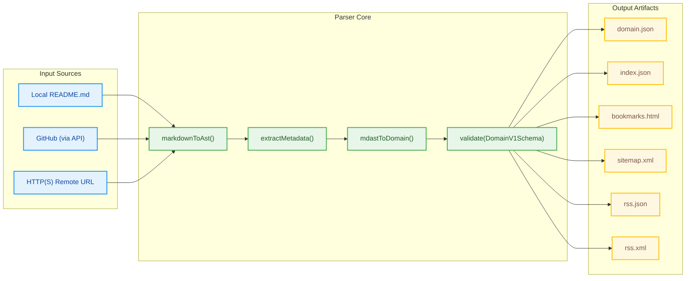

# Awesome Pages Parser

**awesome-pages/parser** is a modular TypeScript pipeline that converts Markdown-based [awesome lists](https://github.com/sindresorhus/awesome) into structured JSON and other reusable artifacts.

It transforms one or multiple `README.md` files into machine-readable formats — making them ready for:

* Static sites (Jamstack)
* Local or client-side search
* Bookmark import/export
* Feed generation (RSS / JSON Feed)
* SEO tools and sitemaps

---

## Installation

Install the package from NPM:

```bash
npm install @awesome-pages/parser
```

Or using pnpm:

```bash
pnpm add @awesome-pages/parser
```

Or using yarn:

```bash
yarn add @awesome-pages/parser
```

---

## Quick Start

### Basic Usage

Parse a markdown file and generate artifacts:

```typescript
import { parse } from '@awesome-pages/parser';

const results = await parse({
  sources: [
    {
      from: 'path/to/awesome-list.md',
      outputs: [
        {
          artifact: 'domain',
          to: 'output/domain.json',
        },
        {
          artifact: 'bookmarks',
          to: 'output/bookmarks.html',
        },
      ],
    },
  ],
});

console.log(`Generated ${results.length} artifacts`);
```

### Parse from GitHub

Parse directly from a GitHub repository:

```typescript
import { parse } from '@awesome-pages/parser';

await parse({
  githubToken: process.env.GITHUB_TOKEN, // optional, for higher rate limits
  sources: [
    {
      from: 'github://sindresorhus/awesome@main:README.md',
      outputs: [
        {
          artifact: ['domain', 'index', 'bookmarks'],
          to: 'dist/{repo}.{artifact}.{ext}',
        },
      ],
    },
  ],
});
```

### Generate Artifacts Programmatically

Use individual artifact generators:

```typescript
import { 
  parse, 
  generateBookmarksHtml, 
  buildIndex 
} from '@awesome-pages/parser';

// Parse to get domain object
const results = await parse({
  sources: [
    {
      from: 'awesome.md',
      outputs: [{ artifact: 'domain', to: 'domain.json' }],
    },
  ],
});

// Load the domain JSON
import { readFile } from 'fs/promises';
const domain = JSON.parse(await readFile('domain.json', 'utf-8'));

// Generate bookmarks HTML
const bookmarksHtml = generateBookmarksHtml(domain);

// Build search index
const searchIndex = buildIndex(domain);
```

### Generate JSON Schema

Get the TypeScript-generated JSON Schema for the Domain v1 format:

```typescript
import { generateDomainV1JsonSchema } from '@awesome-pages/parser';

const schema = generateDomainV1JsonSchema();
console.log(JSON.stringify(schema, null, 2));
```

---

## Overview

The parser reads Markdown and outputs a validated domain model (`DomainV1`) via [Zod](https://zod.dev).
From that core model, multiple **artifacts** can be generated — each designed for a different consumer.

```
README.md
   ↓ parse()
DomainV1 JSON
   ↓ artifacts
 ├── index.json      (inverted index for search)
 ├── bookmarks.html  (browser import)
 ├── sitemap.xml     (SEO discovery)
 ├── rss.json        (modern JSON Feed)
 └── rss.xml         (classic RSS 2.0)
```

### Architecture Diagram



---

## Examples

Example README.md files are available in the `src/tests/fixtures/readmes/` directory. You can test the parser on them, e.g.:

```bash
tsx src/cli.ts src/tests/fixtures/readmes/awesome-click-and-use.md output.json
```

## Available Artifacts

The parser can generate multiple types of output artifacts:

### 1. `domain` (JSON)

The complete domain model with all metadata, sections, and items in a structured JSON format.

### 2. `index` (JSON)

A simplified index of the content, useful for building navigation or search functionality.

### 3. `bookmarks` (HTML)

A browser-compatible bookmarks file in the Netscape Bookmark File Format. Can be imported directly into Chrome, Firefox, Edge, and other modern browsers.

### 4. `sitemap` (XML)

An XML sitemap following the [Sitemap Protocol](https://www.sitemaps.org/protocol.html). Includes all items with valid URLs and can be submitted to search engines like Google and Bing for better indexing.

### 5. `rss-json` (JSON Feed)

A feed in [JSON Feed v1.1](https://jsonfeed.org/version/1.1) format. Modern, JSON-based alternative to RSS/Atom, easier to parse in JavaScript applications. Each item with a URL becomes a feed entry.

### 6. `rss-xml` (RSS 2.0)

A classic RSS 2.0 XML feed compatible with traditional feed readers like Feedly, Inoreader, and Thunderbird. Each item with a URL becomes a feed entry.

## API Reference

### `parse(options: ParseOptions): Promise<ParseResultFile[]>`

Main entry point for parsing awesome lists and generating artifacts.

**Parameters:**
- `options.sources`: Array of source specifications
- `options.githubToken`: Optional GitHub token for API access
- `options.cache`: Enable/disable caching (default: true)
- `options.cachePath`: Custom cache directory
- `options.concurrency`: Number of concurrent operations
- `options.strict`: Fail on validation errors

**Returns:** Array of generated files with metadata

### `generateDomainV1JsonSchema()`

Generates the JSON Schema definition for the Domain v1 format.

### `generateBookmarksHtml(domain: DomainV1): string`

Converts a domain object into browser-compatible bookmarks HTML.

### `buildIndex(domain: DomainV1): SearchIndex`

Builds an inverted search index from a domain object.

---

## TypeScript Support

The library is written in TypeScript and includes complete type definitions. All types are exported for your convenience:

```typescript
import type { 
  DomainV1, 
  SectionV1, 
  ItemV1,
  ParseOptions,
  SourceSpec,
  OutputTarget,
  Artifact,
  ParseResultFile,
  SearchIndex
} from '@awesome-pages/parser';

// Use types in your code
const source: SourceSpec = {
  from: 'awesome.md',
  outputs: [
    {
      artifact: 'domain',
      to: 'output.json'
    }
  ]
};

// Domain model types
const section: SectionV1 = {
  id: 'tools',
  title: 'Tools',
  parentId: null,
  depth: 1,
  order: 0,
  path: 'tools',
  descriptionHtml: null
};
```

---

## Advanced Usage Example

```ts
import { parse } from '@awesome-pages/parser';

await parse({
  sources: [
    {
      from: ['github://user/repo@main:README.md'],
      outputs: [
        {
          artifact: ['domain', 'index'],
          to: 'dist/{repo}.{artifact}.json',
        },
        {
          artifact: 'bookmarks',
          to: 'dist/{repo}.bookmarks.html',
        },
        {
          artifact: 'sitemap',
          to: 'dist/{repo}.sitemap.xml',
        },
        {
          artifact: 'rss-json',
          to: 'dist/{repo}.rss.json',
        },
        {
          artifact: 'rss-xml',
          to: 'dist/{repo}.rss.xml',
        },
      ],
    },
  ],
});
```

---

## Development

### Local Development

```bash
# Clone the repository
git clone https://github.com/awesome-pages/parser.git
cd parser

# Install dependencies
pnpm install

# Run tests
pnpm test

# Run tests in watch mode
pnpm run dev:test

# Build the library
pnpm build

# Lint and format
pnpm run lint
pnpm run format
```

### Scripts

* `pnpm test` — runs the tests (Vitest)
* `pnpm build` — builds ESM and CJS bundles with TypeScript declarations
* `pnpm run dev:test` — runs tests in watch mode
* `pnpm parse` — runs CLI: `tsx src/cli.ts src/tests/fixtures/readmes/awesome-click-and-use.md readme.domain.json`
* `pnpm run lint` — lints code with Biome
* `pnpm run format` — formats code with Biome

### Publishing

This package uses [semantic-release](https://semantic-release.gitbook.io/) for automated versioning and publishing. When commits are merged to the `main` branch:

1. Commit messages are analyzed to determine the version bump (major/minor/patch)
2. CHANGELOG.md is automatically generated
3. Package version is bumped in package.json
4. GitHub release is created with release notes
5. Package is published to NPM

**Commit Message Format:**

Follow [Conventional Commits](https://www.conventionalcommits.org/):

- `feat:` — new feature (minor version bump)
- `fix:` — bug fix (patch version bump)
- `feat!:` or `BREAKING CHANGE:` — breaking change (major version bump)
- `docs:`, `chore:`, `style:`, `refactor:`, `perf:`, `test:` — no version bump

**Example:**

```bash
git commit -m "feat: add support for custom cache strategies"
git commit -m "fix: handle malformed markdown sections"
git commit -m "feat!: change parse() API to accept options object"
```

---

## Part of the Awesome Pages ecosystem

This parser powers the **Awesome Pages** toolchain:

* `awesome-pages/parser`: converts Markdown to structured data
* `awesome-pages/site`: static site generator using parser artifacts
* `awesome-pages/schema`: publishes JSON Schema definitions for validation and interoperability

---

## License

MIT
