# Awesome Pages Parser

**awesome-pages/parser** is a modular TypeScript pipeline that converts Markdown-based [awesome lists](https://github.com/sindresorhus/awesome) into structured JSON and other reusable artifacts.

It transforms one or multiple `README.md` files into machine-readable formats — making them ready for:

* Static sites (Jamstack)
* Local or client-side search
* Bookmark import/export
* Feed generation (RSS / JSON Feed)
* SEO tools and sitemaps

---

## Overview

The parser reads Markdown and outputs a validated domain model (`DomainV1`) via [Zod](https://zod.dev).
From that core model, multiple **artifacts** can be generated — each designed for a different consumer.

```
README.md
   ↓ parse()
DomainV1 JSON
   ↓ artifacts
 ├── index.json      (inverted index for search)
 ├── bookmarks.html  (browser import)
 ├── sitemap.xml     (SEO discovery)
 ├── rss.json        (modern JSON Feed)
 └── rss.xml         (classic RSS 2.0)
```

### Architecture Diagram

```mermaid
flowchart LR
    subgraph Input["🗂️ Input Sources"]
        A1["Local README.md"]
        A2["GitHub (via API)"]
        A3["HTTP(S) Remote URL"]
    end

    subgraph Core["⚙️ Parser Core"]
        B1["markdownToAst()"];
        B2["extractMetadata()"];
        B3["mdastToDomain()"];
        B4["validate(DomainV1Schema)"];
    end

    subgraph Outputs["📦 Artifacts"]
        C1["domain.json"]
        C2["index.json"]
        C3["bookmarks.html"]
        C4["sitemap.xml"]
        C5["rss.json"]
        C6["rss.xml"]
    end

    A1 & A2 & A3 --> B1 --> B2 --> B3 --> B4 --> C1 & C2 & C3 & C4 & C5 & C6
```



---

## Scripts

* `pnpm test` — runs the tests (Vitest)
* `pnpm build` — compiles TypeScript
* `pnpm parse` — runs CLI: `tsx src/cli.ts src/tests/fixtures/readmes/awesome-click-and-use.md readme.domain.json`

## Examples

Example README.md files are available in the `src/tests/fixtures/readmes/` directory. You can test the parser on them, e.g.:

```bash
tsx src/cli.ts src/tests/fixtures/readmes/awesome-click-and-use.md output.json
```

## Available Artifacts

The parser can generate multiple types of output artifacts:

### 1. `domain` (JSON)

The complete domain model with all metadata, sections, and items in a structured JSON format.

### 2. `index` (JSON)

A simplified index of the content, useful for building navigation or search functionality.

### 3. `bookmarks` (HTML)

A browser-compatible bookmarks file in the Netscape Bookmark File Format. Can be imported directly into Chrome, Firefox, Edge, and other modern browsers.

### 4. `sitemap` (XML)

An XML sitemap following the [Sitemap Protocol](https://www.sitemaps.org/protocol.html). Includes all items with valid URLs and can be submitted to search engines like Google and Bing for better indexing.

### 5. `rss-json` (JSON Feed)

A feed in [JSON Feed v1.1](https://jsonfeed.org/version/1.1) format. Modern, JSON-based alternative to RSS/Atom, easier to parse in JavaScript applications. Each item with a URL becomes a feed entry.

### 6. `rss-xml` (RSS 2.0)

A classic RSS 2.0 XML feed compatible with traditional feed readers like Feedly, Inoreader, and Thunderbird. Each item with a URL becomes a feed entry.

## Usage Example

```ts
import { parse } from './src/api/index';

await parse({
  sources: [
    {
      from: ['github://user/repo@main:README.md'],
      outputs: [
        {
          artifact: ['domain', 'index'],
          to: 'dist/{repo}.{artifact}.json',
        },
        {
          artifact: 'bookmarks',
          to: 'dist/{repo}.bookmarks.html',
        },
        {
          artifact: 'sitemap',
          to: 'dist/{repo}.sitemap.xml',
        },
        {
          artifact: 'rss-json',
          to: 'dist/{repo}.rss.json',
        },
        {
          artifact: 'rss-xml',
          to: 'dist/{repo}.rss.xml',
        },
      ],
    },
  ],
});
```

---

## Part of the Awesome Pages ecosystem

This parser powers the **Awesome Pages** toolchain:

* `awesome-pages/parser`: converts Markdown to structured data
* `awesome-pages/site`: static site generator using parser artifacts
* `awesome-pages/schema`: publishes JSON Schema definitions for validation and interoperability
